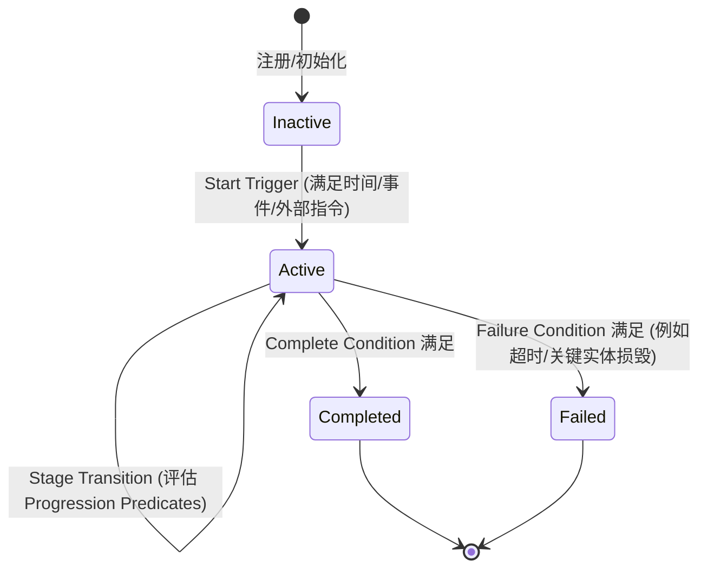

# StoryArc Feedback RFC

> **Status: Early Draft / Paused / Not active implementation guidance.**
> **Superseded by STORYARC_FEEDBACK_GATE.md for current execution control.**
> **This RFC is a research document, not an implementation task.**
> **这不是实现计划，不是代码修改指令。**
> **这是故事线（StoryArc）反馈机制在 Persistent World 引擎中的边界定义与物理数据格式 RFC。**
> **注意：本 RFC 中的所有代码片段和数据结构设计均为 illustrative pseudo-code / candidate shape, 不作为最终的 implementation contract。**
> **本文档中的具体例子（如"harvest festival"、"village mystery"）均为 illustrative domain examples，不代表已批准的实现方案。**

---

## 1. Context

### 1.1 当前状态

Andy Engine v0.2.0 的 Agent 动力学完全由个体微观系统（需求衰减、情绪演化、日程安排、记忆检索）驱动，外加局部社交交互（相遇、对话）。

目前，引擎缺乏一种全局或区域性的**叙事上下文（StoryArc / Narrative Context）**，即跨越多个时间步长、影响多位 Agent 的宏观情节线（例如"harvest festival"、"severe weather event"、"mystery investigation"）。

传统的叙事/游戏引擎倾向于使用强力脚本（Scripted Railroad）直接干预 Agent 的属性值或强制切换行为状态。这严重破坏了 Andy Engine 的三大核心支柱：
1. **Agent 的决策自主性（Autonomy）**
2. **基于 BehaviorField 的 Langevin 连续动力学演化**
3. **心理学各子系统（OCEAN, Maslow, ACT-R）的自洽闭环**

因此，我们需要一个**间接影响层（Indirect Influence Layer）**，使 StoryArc 能够像环境重力一样微调 Agent 的外部事件概率与内部认知滤镜，而不是直接越过心理子系统去操纵它们。

### 1.2 核心约束（四不原则）

StoryArc 反馈系统必须严格遵守以下边界约束：
1. **不直接修改情绪向量值**（Do not directly set emotion values）：禁止强行将 Agent 的悲伤（sadness）设为 1.0。情绪必须由认知评价（Appraisal）或物理事件效果（Effects Delta）经由正常情绪演化管线自然流动产生。
2. **不直接指定行为 label 或 B 向量**（Do not directly set behavior labels or bypass BehaviorField）：行为决策的最终决定权永远归 BehaviorField Langevin 动力学所有。
3. **不强行修改社交关系**（Do not force relationships）：禁止直接写入 Relationship.js 中的亲密度数值。关系的发展必须由事件和对话媒介自然积累。
4. **不篡改或绕过 Agent.tick() 的主逻辑**（Do not override Agent.tick()）：Agent 的认知闭环必须保持完整，所有的感知、评价、调节、行为场计算与记忆流动均应如常运行。

---

## 2. 问题 1：StoryArc 的物理与数据定义

### 2.1 什么是 StoryArc？

在引擎物理层，StoryArc 是一个**带有状态变量、生命周期、且能产生环境与认知扰动的叙事状态机**。

它由两部分组成：
- **StoryArc Template (在 Domain Config 中声明)**：静态规则定义，描述触发条件、阶段（Stages）定义、以及各个阶段对应的环境与认知干预参数。
- **StoryArc Instance (在运行时 World 状态中生存)**：包含当前的执行状态，如当前阶段、已运行 tick 数、叙事内部变量（`variables`）。

### 2.2 结构化数据定义

```javascript
// StoryArc 实例物理结构（illustrative candidate shape）
{
  // ─── 身份与类型 ───
  id: string,                    // 唯一实例 ID
  templateId: string,            // 引用 Domain Config 中的模板 ID
  name: string,                  // 人类可读名称
  
  // ─── 生命周期状态 ───
  status: 'inactive' | 'active' | 'completed' | 'failed',
  currentStage: string,          // 当前所处的叙事阶段 ID
  tickStarted: number,           // 激活时的 tick 数
  tickEnteredStage: number,      // 进入当前阶段的 tick 数
  
  // ─── 叙事变量（持久化状态）───
  variables: {                   // 存储叙事私有变量，支持复杂故事逻辑
    witnessCount: number,
    isClueFound: boolean,
    targetAgentId: string,
  },
  
  // ─── 控制参数 ───
  cooldowns: {                   // 限制事件触发频率
    lastEventTick: number,
  }
}
```

---

## 3. 问题 2：间接影响机制（四大物理通道）

StoryArc 严禁直切状态，它只能通过以下 4 个通道间接影响角色：

```
StoryArc
  ├── 通道 A: 概率性向 EventDispatcher 注入环境事件 (World Events)
  ├── 通道 B: 向 GoalSystem 注入条件化吸引子目标 (Goal Injections)
  ├── 通道 C: 微调 Agent Appraisal 的 Scherer 评价偏置 (Appraisal Bias)
  └── 通道 D: 在 ACT-R 检索公式中添加启动权重 (Memory Priming)
```

### 3.1 通道 A：事件生成器 (Event Generator)

在不同的 StoryArc 阶段，系统会自动或概率性地向 `EventDispatcher` 注入特定的**环境/世界事件 (World Event)**。这些事件会被范围内的 Agent 感知，进而触发认知评价、情绪和记忆。

- **工作机制**：在每个 tick，处于 `active` 状态的 StoryArc 会根据当前阶段的 `eventRules` 评估是否生成事件。
- **Seeded RNG 路由**：事件生成的概率判定与参数选择必须路由自 `world.rng`，确保在相同 Seed 下故事线的发展完全可重现。
- **示例**：在 "暴风雪季" 的 Stage 1，每 tick 有 15% 的概率生成一个全局的 `weather_storm` 事件，促使受影响的 Agent 移动至室内。

### 3.2 通道 B：目标注入 (Goal Injection)

StoryArc 可以作为 **GoalSource.WORLD_EVENT** 来源，向指定 Agent 的目标管理器（GoalSystem）注入短期或长期的**条件化 4D 吸引子目标**（符合 Phase 23 物理定义）。

- **工作机制**：当 StoryArc 进入特定阶段或满足触发条件时，向目标 Agent 注入目标。目标包含 `B_star` 吸引子与声明式完成谓词 `completion.predicate`。
- **不直接修改行为**：目标作为第 8 个梯度源（`∇U_goal`）进入 BehaviorField 参与合力计算。如果 Agent 此时处于极度饥饿（Needs 匮乏），该叙事目标仍会被生理需求梯度抑制。
- **示例**：在 "harvest preparation" 阶段，向相关 Agent 注入 "prepare for harvest" 目标：
  - `B_star` = `[0.60, 0.30, 0.70, 0.20]` (moderate activity, low social, high focus, low expressiveness)
  - `priority` = 0.75
  - `completion.predicate` = `{ type: 'ticks_in_region', region: 'workshop', minTicks: 24 }`

### 3.3 通道 C：认知评价偏置 (Cognitive Appraisal Bias / Scherer CPM Adjustment)

这是最具心理学特色的间接影响通道。StoryArc 会微调 Agent 的**认知滤镜**，改变他们对日常事件的心理评估。

- **工作机制**：在 `Agent._perceiveEvents()` 阶段，当事件被送入 Scherer CPM 评估器时，Appraisal 系统会查询当前处于激活状态的 StoryArc，并应用其定义的**偏置矩阵 (Appraisal Modifier)**。
- **数学偏置公式**：
  Scherer CPM 评估的 4 个核心维度：
  - `novelty` (新奇度) ∈ `[0, 1]`
  - `pleasantness` (愉悦度) ∈ `[-1, 1]`
  - `goalRelevance` (目标关联度) ∈ `[0, 1]`
  - `copingPotential` (应对潜能) ∈ `[0, 1]`
  
  偏置作用方程：
  $$\text{Dimension}_{\text{biased}} = \text{clamp}(\text{Dimension}_{\text{raw}} \cdot \text{scale} + \text{offset}, \text{min}, \text{max})$$
  
- **示例**：在 "流言蜚语" 故事线中，任何社交冲突事件的 `novelty` 放大 1.5 倍（容易引起警觉），`pleasantness` 额外减少 0.2（使情绪反应更负面），`copingPotential` 降低 20%（引发更多焦虑/退缩情绪）。

### 3.4 通道 D：记忆检索偏置 (Memory Prime / ACT-R Salience Bias)

StoryArc 可以通过**启动效应 (Priming Effect)**，暂时提高特定主题或语义记忆在 ACT-R 检索中的激活度（Activation），从而影响心智游荡和行为决策。

- **工作机制**：在 `PersonalMemory.retrieve()` 过程中，当计算某条记忆 $i$ 的激活度 $A_i$ 时，Active StoryArcs 提供一个额外的**启动值项 (Priming Term) $P_{story}$**：
  $$A_i = B_i + S_i + P_{story} + \epsilon$$
  其中，若记忆 $i$ 的 `semanticCategory` 或 `associations` / `keywords` 匹配 StoryArc 当前阶段的 `primeKeywords`，则根据关联权重给予 $P_{story} > 0$ 的加成。
- **示例**：在 "village mystery" 故事线中，活跃阶段的 `primeKeywords` 为 `['secret', 'clue', 'stranger']`。任何包含这些关键词的过去记忆在检索时都会获得 $+1.2$ 的激活度加成，使得 Agent 在心智游移或行为选择时更容易回想起相关的陈旧记忆。

---

## 4. 问题 3：生命周期与状态演化

StoryArc 的生命周期包含以下状态转移模型：



### 4.1 阶段演化谓词 (Progression Predicates)

StoryArc 的阶段跳转使用声明式谓词判定，与 GoalPredicate 保持一致，不依赖任何运行时代码：
```typescript
type ArcPredicate =
  | { type: 'tick_elapsed'; ticks: number }
  | { type: 'event_occurred'; eventType: string; count: number }
  | { type: 'agent_goal_status'; agentId: string; goalId: string; status: 'completed' | 'expired' | 'failed' }
  | { type: 'variable_compare'; key: string; operator: 'eq' | 'gt' | 'lt'; value: any }
```

这些谓词只被引擎主循环观察，用于推进 Stage，不直接干涉 Agent 的内存。

---

## 5. 问题 4：所有权与持久化 (Stable Envelope vs. Opaque Payload)

为了在版本迭代中保护世界状态的稳定性，StoryArc 数据结构遵循**双层划分原则**。

### 5.1 Stable Envelope 中的 StoryArc

> [!WARNING]
> **本 RFC 不授权修改 Stable World Envelope。** 以下内容仅作为未来可能演进的候选方案设计（Potential future Stable Envelope extension, not approved by this RFC），当前版本禁止在此处引入任何 Stable Envelope 结构变动。

Stable Envelope 仅存储**叙事外壳与不可变状态标识**，作为外部系统（如 UI 渲染、日志分析）安全读取的公共契约：
```json
{
  "storyArcs": [
    {
      "id": "arc_exam_2026",
      "templateId": "midterm_exams",
      "status": "active",
      "currentStage": "preparation_stage"
    }
  ]
}
```

### 5.2 runtimeSnapshot 中的 StoryArc (Opaque Payload)

runtimeSnapshot 负责完整序列化**运行时的动力学变量和控制流**：
```json
{
  "storyArcs": {
    "arc_exam_2026": {
      "id": "arc_exam_2026",
      "templateId": "midterm_exams",
      "status": "active",
      "currentStage": "preparation_stage",
      "tickStarted": 1200,
      "tickEnteredStage": 1450,
      "variables": {
        "anxietyLevelSum": 2.45,
        "failedStudents": []
      },
      "cooldowns": {
        "lastEventTick": 1420
      }
    }
  }
}
```

在迁移（World Migration）过程中，仅对处于 active 状态的活跃 StoryArc 进行变量对齐，已结束的叙事作为历史存档不再需要迁移。

---

## 6. 问题 5：Domain Config 声明

> [!WARNING]
> **以下为候选的 Domain Config 新增字段，未获得本 RFC 授权。**
> **Future Domain Config candidate fields, not approved by this RFC.**
> **此处所有配置仅作为 illustrative pseudo-code / candidate shape, 不作为最终的 implementation contract。**

所有的 StoryArc 模版均在 Domain Config 的 `storyArcTemplates` 中进行声明，从而彻底隔离核心引擎与特定的世界业务语义。

```javascript
// Domain Config 新增示例（illustrative, not approved）
storyArcTemplates: {
  'harvest_festival': {
    name: 'Harvest Festival',
    stages: {
      'preparation_stage': {
        duration: 288, // 1 day (288 ticks)
        eventRules: [
          { type: 'market_activity', probability: 0.1, target: 'marketplace' }
        ],
        goalInjections: [
          {
            agentFilter: 'all_workers',
            goal: {
              category: 'work',
              priority: 0.75,
              attractor: { B_star: [0.60, 0.30, 0.70, 0.20], region: 'workshop' }
            }
          }
        ],
        appraisalModifier: {
          social_friction: {
            pleasantness_offset: -0.15,
            coping_potential_scale: 0.8
          }
        },
        primeKeywords: ['harvest', 'prepare', 'stock', 'trade']
      },
      'festival_stage': {
        // ... next stage
      }
    }
  }
}
```

所有的 `storyArcTemplates` 必须通过 `validateDomain()` 中的强校验，防止空指针或无效物理坐标泄露。

---

## 7. 开放问题

1. **跨角色同步性**：如果一个 StoryArc 需要在两个相距遥远的 Agent 之间同步，如何通过空间引擎（SpatialEngine）或社交图谱（SocialGraph）传播叙事效果？
2. **多 StoryArc 叠加冲突**：当 "寒冬暴雪" 与 "狂欢节日" 两个故事线同时激活时，它们对同一个 Appraisal 维度的偏置该如何融合？（建议采用相乘叠加或优先级屏蔽机制）。
3. **叙事分支选择**：当 Progression Predicate 满足时，StoryArc 能够走向不同的分支阶段？（例如，根据 `variables.isClueFound` 决定进入 `solved_stage` 还是 `failed_stage`）。

---

## 8. Future Implementation Candidate

Future Implementation Candidate, phase number TBD.
